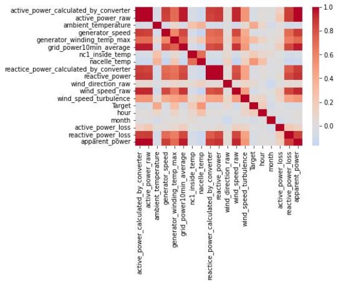

# Renew-Power-Hackathon
Renew Power Hackathon organised by Machine Hack

APPROACH:-

Hackathon

Approach Presented By: Akshay Thorat

` `

Introduction

- In this hackathon, ReNew Power shared minute-wise normalized data of wind speed, power and temperature data for multiple components of a wind turbine. 
- The company is looking to create a model to get an ideally functioning turbine’s expected rotor bearing temperature.
- It will then use the model to check the deviation of the actual rotor bearing temperature of the faulty turbine from the expected temperature.

Data Description

- Dataset is divided into 15 features and one Target variable
- 15 features can be broadly classified into 4 factors:
  - Power factor:- Active Power, Reactive Power (both raw and converted), generator speed and Average Power for 10 minutes.
  - Temperature factor:- Ambient Temperature, Nacelle Temperature(both inside and outside) and wire winding temperature
  - Wind factor:- Wind speed, wind direction, wind speed Turbulence
  - Other:- Timestamp and Turbine Id
  - We have to predict Rotor bearing Temperature.

` `
Feature Engineering

Hypothesis 1: *Wind Speed and Ambient Temperature are Time and season specific. Hence, there is a need to extract time and season features from timestamp variable*

New Features created: - Hour (Time specific), Month(Season specific) Hypothesis 2 :- *Rotor Bearing Temperature is dependent on power loss*

New Features created: - Active Power loss, Reactive Power loss and Apparent Power(Active+Reactive)

Feature Engineering

- 
- 
- 

Exploratory Data Analysis-Univariate Analysis

- Most of the Features are right-skewed having high presence of outliers

 

- Target Variable is normally distributed having outliers present on both sides. It shares similarity with nacelle temperature 

 

Bivariate Analysis:- Correlation

- We can observe that variables  are highly correlated. Specially  power factor variables are highly  correlated  

Bivariate Analysis: Turbine Id vs Target

- Target variation is significant  w.r.t Turbine id 
- We can observe that Turbine 20  and Turbine 1 shows high  variability in Rotor bearing  Temperature 

Bivariate Analysis: Hours vs Target

- We can observe that, Median  Rotor Bearing Temperature do  increase in the noon. 

Bivariate Analysis: Months vs Target

- Median Bearing Temperatures are higher in the month of  March, April, May and June. 
- March and April  data shows  High Variability. 

Feature Selection

- Since, Highly correlated features are present in the dataset. Feature Selection has been done to reduce noise.
- Method Selected:-Forward Feature selection
- Estimator Used:- Decision Tree Regressor is chosen over Linear Regression due to presence of outliers.
- Scoring:- MAPE

Feature Selection list

- Following were the features  selected using forward feature  selection: 

Model Training

Model Training

Scoring=‘MAPE

` `

Decision Tree

0.00825

Random Forest

0.007288

Extra Tree Regressor

0.005512

` `

Model selection

- Extra Tree Regressor model was performing better than other ensemble models. Hence it was selected for final prediction

Feature Importance

- We can observe that in Extra   tree Regressor model training,  following are important  features:- 
- Ambient Temperature:- Explaining 20 % variability 
- Turbine Id:- 23% variability 
- Month:- 28% variability 

` `
